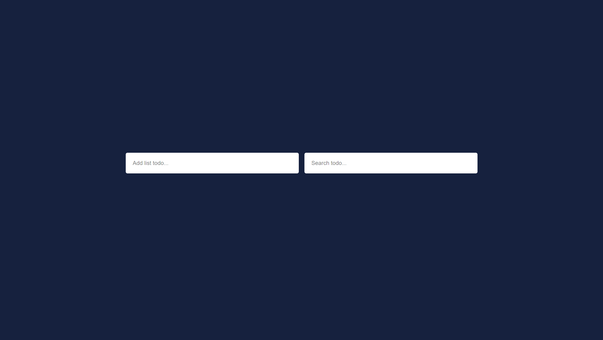
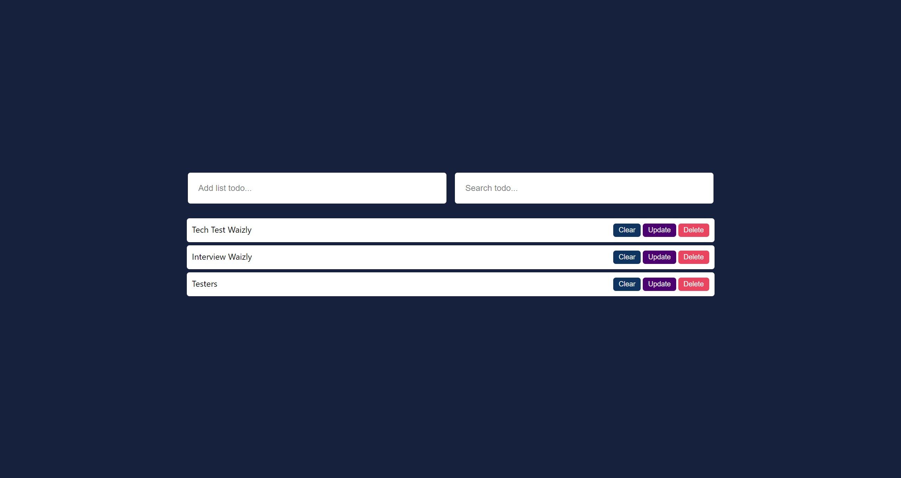
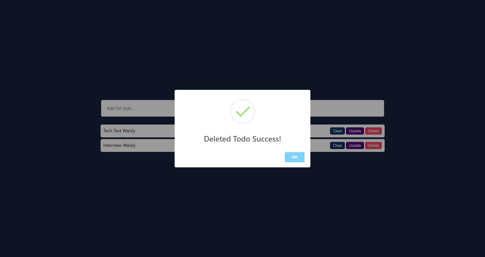
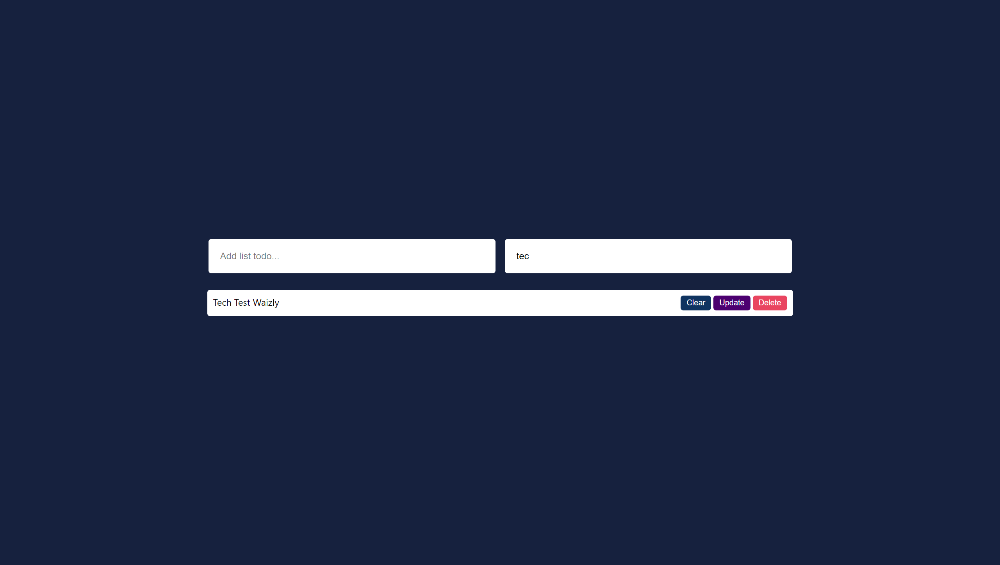

# ToDoApp with React JS
## Description
This is ToDo App uses React JS for Developer Technical Test in Implementation Test - Frontend at Waicly Technology Company.

## Technologies
### Frontend
- ReactJS
- HTML
- CSS
- JavaScript

## Folder Structure
- components
  - TodoForm.js
  - TodoItem.js
  - TodoList.js  
- data
  - localstorage.js
- App.js

## Demo *(in development)*
<b>Please wait.</b>

<details>
	<summary>Home Page</summary>
	

</details>

<details>
	<summary>List Page</summary>
	

</details>

<details>
	<summary>Animation</summary>
	

</details>

<details>
	<summary>Filter Todo</summary>
	

</details>

## Installation
### Clone Repo

```bash
git clone https://github.com/GrahadiM/ToDo-App-with-React-JS.git
```
### Go to folder

```bash
cd ToDo-App-with-React-JS
```
### Install and build App with npm

```bash
npm install
```
and
```bash
npm run dev
```
### Run App

```bash
npm run start
```
